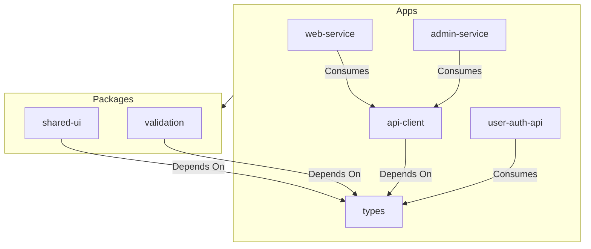

# 🌌 NestJS Monorepo

A high-performance, scalable monorepo architecture for modern full-stack development, powered by **Turbo**, **NestJS**, and **React**.

---

## 🏗️ Architecture



### Workspaces

| Path | Name | Description |
| :--- | :--- | :--- |
| `apps/web-service` | `@apps/web` | Customer-facing React frontend with Redux Toolkit. |
| `apps/admin-service` | `@apps/admin` | Dashboard for administrators with specialized controls. |
| `user_service` | `user-auth-api` | NestJS backend providing JWT auth and user management. |
| `packages/api-client` | `@monorepo/api-client` | Standardized Axios client with automatic auth handling. |
| `packages/types` | `@monorepo/types` | Shared TypeScript interfaces and enums across the stack. |
| `packages/shared-ui` | `@monorepo/ui` | Reusable React components and Storybook. |
| `packages/validation` | `@monorepo/validation` | Zod or Class-Validator shared schemas. |

---

## 🚀 Getting Started

### Prerequisites
- Node.js (v18+)
- npm (v9+)
- PostgreSQL

### Installation
From the root directory:
```bash
npm install
```

### Development
Start all services simultaneously:
```bash
npm run dev
```

### Build
Build all packages and apps for production:
```bash
npm run build
```

---

## 🛠️ Unified Development Commands

- `npm run dev`: Start all apps in watch mode.
- `npm run build`: Build all workspaces via Turbo.
- `npm run lint`: Lint the entire project.
- `npm run test`: Run tests across all workspaces.
- `npm run clean`: Remove all `dist` and `node_modules`.

---

## 🔐 Auth Pattern
The project uses a **Secure In-Memory JWT** pattern:
1. Tokens are returned by `user-auth-api`.
2. `api-client` manages tokens in a private closure (not `localStorage`).
3. Tokens are automatically attached to outgoing requests.
4. Route protection is handled via shared `ProtectedRoute` components.

---

## 📦 Next Steps
1.  **Environment Setup**: Configure `.env` files in `user_service`, `apps/web-service`, and `apps/admin-service`.
2.  **Shared UI**: Add your base components to `packages/shared-ui` for cross-app consistency.
3.  **Deployment**: Configure your Docker or CI/CD pipelines to build via the root `npm run build`.
